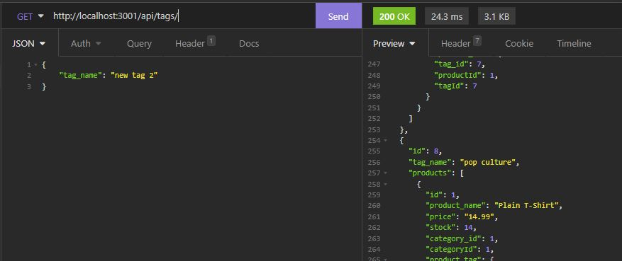

# E-Commerce Node.js Application

## Description

This is a Node.js application that utilizes a MySQL database with 4 tables - categories, products, tags, and productTags to bring products and tags together.

This project uses Express.js to create API endpoints so a user can update the various tables in the application. There is no front-end HTML at this time.

## Table of Contents

- [Description](#description)
- [Installation](#installation)
- [Usage](#usage)
- [License](#license)
- [Contributing](#contributing)
- [Questions](#questions)

## Installation

- Download or clone the project files to your local system
- Download and install Node.js and MySQL if you don't have them already
- Open a terminal window
- Navigate to the directory in which you placed the project files
- Type the command 'npm install' to install all project dependencies

## Usage

- Follow instructions from the installation section
- Open a terminal window
- Navigate to the directory you saved your project files in
- Login to MySQL and type 'source db/schema.sql' to create the database. Exit MySQL shell.
- Type 'node seeds/index' to create the tables and insert data
- Type 'npm start' to start the application
- Use a browser or the Insomnia app to test the various end points

### Screenshot:

### Video Walkthrough:

[Video Walkthrough - Part 1](./assets/video/E-Commerce-Part1.mp4)

[Video Walkthrough - Part 2](./assets/video/E-Commerce-Part2.mp4)

## License

This project is covered under the [GNU General Public License v3.0](https://www.gnu.org/licenses/)

## Contributing

If you wish to contribute to this project, follow these steps:

- Fork the repository
- Clone or download to your local
- Make any changes/updates and push to your remote fork
- Start a pull request

## Questions

View my [GitHub Page](https://github.com/JonMooney)

Send me an email @ [jon.mooney@yahoo.com](mailto:jon.mooney@yahoo.com)